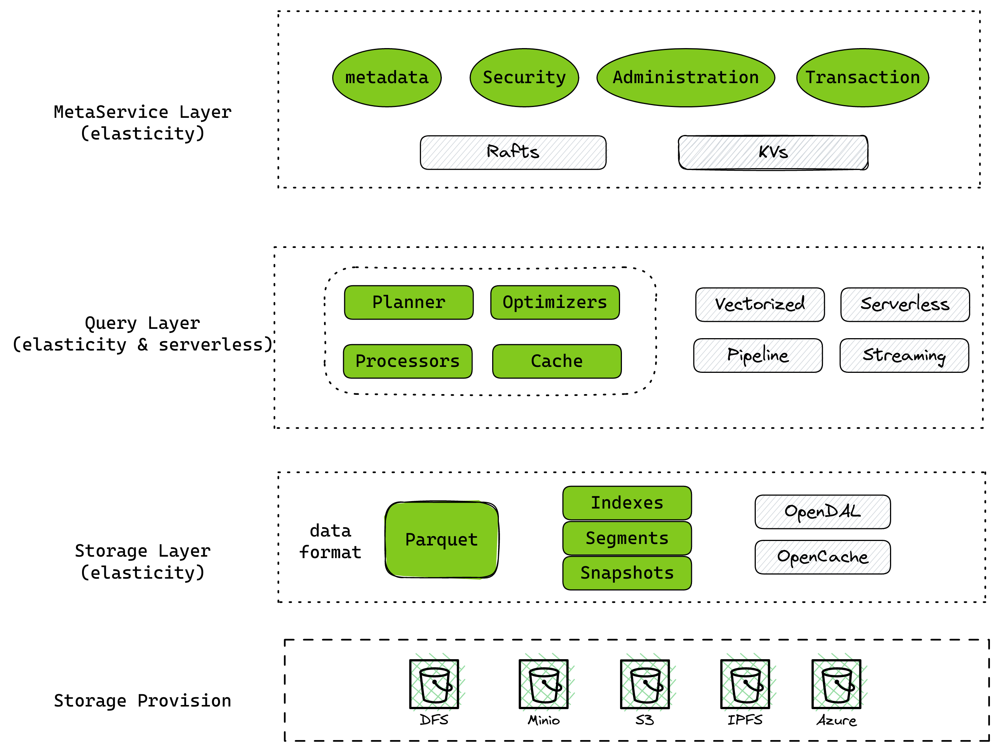

## MinIO 简介

MinIO是个高性能，云原生的对象存储。它提供了与 Amazon S3 云存储服务兼容的 API，使用 MinIO 为机器学习、分析和应用程序数据工作负载构建高性能基础架构。轻量，操作简单。

## Databend 简介

Databend 是一个使用 Rust 研发、开源、完全面向云架构的新式数仓，提供极速的弹性扩展能力，致力于打造按需、按量的 Data Cloud 产品体验。具备以下特点：

- 开源 Cloud Data Warehouse 明星项目
- Vectorized Execution 和 Pull&Push-Based Processor Model
- 真正的存储、计算分离架构，高性能、低成本，按需按量使用
- 完整的数据库支持，兼容 MySQL, Clickhouse 协议
- 支持事务，支持 Time Travel, Database Clone, Data Share 等功能
- 支持基于同一份数据的多租户读写、共享操作


**开源地址：**<https://github.com/datafuselabs/databend/>

**官方文档：**<https://databend.rs>

## 理解 Databend 架构



Databend 是一个开源的云原生数仓，为了更好的适用于云环境，Databend 从架构上分为三层：MetaService 层，Query 层，存储层。

**MetaService 层**

这是 Databend 司令部，存储：权限定义，表结构定义，事务管理，表和数据的关联以及数据共享的整体逻辑。推荐集群方式部署。

**Query 层**

Query 层是 Databend 中直接和用户交互及调用存储的一层。用户通过 SQL 和 Databend 交互，Query层接到用户的请求后读写存储层。该层不用实时在线，使用时拉起，同时也支持动态扩容及收缩。

**存储层**

Databend 的存储层推荐使用云上的对象存储或是自建对象存储。Databend 在存储引擎这块使用了大数据生态的：Parquet 格式，同时引入了: min/max 索引，稀疏索引，bloom 索引等。

## Databend 支持的部署环境

| 部署环境      | Databend |
| ------------- | -------- |
| 是否开源      | 是       |
| AWS S3        | 支持部署 |
| Google GCS    | 支持部署 |
| Azure Blob    | 支持部署 |
| 阿里云 OSS    | 支持部署 |
| 腾讯 COS      | 支持部署 |
| 华为云 OBS    | 支持部署 |
| MinIO         | 支持部署 |
| Ceph          | 支持部署 |
| 青云 QingStor | 支持部署 |

详细参考：https://databend.rs/doc/deploy/deploying-databend

## 单机部署 MinIO + Databend

实质上 MinIO 环境单机搭建比较容易，但后期的扩容还是比较麻烦，MinIO + Databend 比较适合走一下流程，这个环境也是 Databend 很多同事的开发环境。但 Databend 真正的测试及性能测试都是基于 AWS S3 环境运行。

Databend 部署方式比较简单，这里以 Linux 下  MinIO + Databend 单机部署部署为例，如果你是在公有云上部署，就更加简单。

| 软件     | 位置           | 监听端口                                  |
| -------- | -------------- | ----------------------------------------- |
| MinIO    | /data/minio    | 9900                                      |
| Databend | /data/databend | mysql:3307Http: 8000Clickhouse http: 8124 |


### Minio 搭建

官方地址：https://min.io/

从官方下载 MinIO 并启动

```bash
cd /data 
mkdir minio
cd minio 
wget https://dl.min.io/server/minio/release/linux-amd64/minio
export MINIO_ROOT_USER=minioadmin
export MINIO_ROOT_PASSWORD=minioadmin
#./minio server ./data
./minio server --address :9900 ./data
```

利用 WEB 界面打开 MinIO 管理测，打开后创建一个: databend bucket.

完成这个 bucket 创建后，MinIO 部署部分已经完成。

### Databend 下载

建议可以从 Databend 的开源项目的 repo 里下载，每天都会有一个对应的 release , 具体的地址：https://github.com/datafuselabs/databend/tags

国内下载可以通过 aws s3 下载：https://databend.rs/download

| 文件类型                                                   | 适用平台               |
| ---------------------------------------------------------- | ---------------------- |
| databend-version-nightly-aarch64-apple-darwin.tar.gz       | 适用于 m1 的mac系统    |
| databend-version-nightly-aarch64-unknown-linux-musl.tar.gz | 适用于 arm 的  linux   |
| databend-version-nightly-x86_64-apple-darwin.tar.gz        | 适用于 x64 的 mac 系统 |
| databend-version-nightly-x86_64-unknown-linux-musl.tar.gz  | 适用于 x64 的 linux    |
| source code                                                | 对应的源码             |

一般 Linux 下我们下载 musl 包就可以，注意是 arm 或 x86_64 平台的区分。

下载地址：

```bash
https://repo.databend.rs/databend/v0.8.80-nightly/databend-v0.8.80-nightly-x86_64-unknown-linux-musl.tar.gz
```

对版本选择建议下载每天的最新版本，Databend 开发速度比较快，很多新特性合并的也比较快。部署 Databend ：

```bash
cd /data
mkdir databend 
wget https://repo.databend.rs/databend/v0.8.80-nightly/databend-v0.8.80-nightly-x86_64-unknown-linux-musl.tar.gz
cd databend
tar zxvf ../databend-v0.8.25-nightly-x86_64-unknown-linux-musl.tar.gz
```

### Databend 布置

默认下载的配置文件，需要修改 databend-query 的配置就可以使用了。

```bash
vim configs/databend-query.toml
```

修改部分

```toml
# Storage config.
[storage]
# fs | s3 | azblob | obs
type = "s3"

# Set a local folder to store your data.
# Comment out this block if you're NOT using local file system as storage.
[storage.fs]
data_path = "./.databend/stateless_test_data"

# To use S3-compatible object storage, uncomment this block and set your values.
[storage.s3]
bucket = "databend"
endpoint_url = "https://127.0.0.1:9900"
access_key_id = "minioadmin"
secret_access_key = "minioadmin"
```

### Databend 启动 & 环境校验

#### **启动 Databend**

```bash
./script/start.sh
ps axu |grep databend
```

#### **关闭 Databend**

```bash
./script/stop.sh 
```

#### **连接 Databend**

Databend 默认对外有三个服务端口：

MySQL : 3307 支持 MySQL cli，应用程序连接。

Clickhouse: 8124 Clickhouse http handler 协议

这里我们以 MySQL client 连接举例：

```bash
mysql -h 127.0.0.1 -P3307 -uroot
```

需要注意 root 可以通过 localhost 实现无密码登录。Databend 权限管理参考了 MySQL 8.0 的设计，可以按 MySQL 8.0 的用户管理来管理 Databend 的用户。

Clickhouse 协议使用：<https://databend.rs/doc/reference/api/clickhouse-handler>

到此 Databend 单机基本部署就完成了。使用上就可以相当于使用一个 MySQL 一样来使用了。
